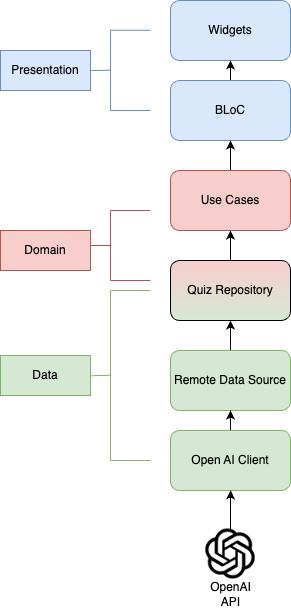

# Quiz Generator
This project is a Quiz Generator that uses the OpenAI API to generate quiz questions. It's built with Dart and Flutter, making it a cross-platform application that can run on Android, iOS, and web.

## Architecture
The project follows a clean architecture pattern, which separates the codebase into layers:

### data:
This layer handles data manipulation and conversion. It communicates with the OpenAI API to fetch data and convert it into a format that the application can use.

### domain:
This layer contains the business logic of the application. It defines the rules for how users can interact with the quiz data.

### presentation:
This layer handles the UI and user interactions. It displays the quiz data on the screen and responds to user inputs.

### di:
This layer is responsible for dependency injection. It uses the get_it package to provide dependencies to the other layers.

### util:
This layer contains utility classes and functions that are used across the application.

## Usage
To use the application, you need to enter a category and select a difficulty level. The application will then generate a set of quiz questions based on your inputs.

## Setup
To set up the project, you need to have Flutter and Dart installed on your machine. After cloning the project, run `flutter pub get` to fetch the dependencies. Next, `dart run build_runner build --delete-conflicting-outputs` run to start code generation. Then, you can run `flutter run` to start the application.

## Testing
TODO. The project does not include unit tests.

## Contributing
Contributions are welcome! If you find a bug or have a feature request, please open an issue. If you want to contribute code, please open a pull request.

## License
This project is licensed under the MIT License.